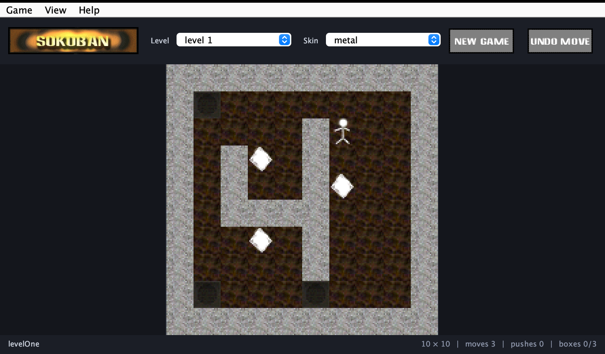

# Sokoban

A standalone desktop Sokoban for modern Java, rebuilt from the 1990s-era browser applet
that used to live in this directory. Its source signs itself `Sokoban Ver. 1.00 - Java Port By
ReneGade/TiS`; ReneGade/TiS was the handle of this repository's owner at the time, so the applet
and the rebuild have the same author. The original tiles, skins, logo and levels are preserved;
the game logic, rendering and level parsing were rewritten. A hundred and fifteen levels and
three skins ship with it — see [Levels](#levels).



## Build and run

Requires JDK 17 or newer (built and tested on JDK 26).

```sh
mvn                       # default goal is `package`
java -jar target/sokoban-2.0.0.jar

# or, without packaging
mvn exec:java
```

An optional argument opens a level file directly:

```sh
java -jar target/sokoban-2.0.0.jar my-levels/warehouse.xsb
```

A native macOS bundle can be produced with the JDK's own packager:

```sh
jpackage --name Sokoban --app-version 2.0.0 --type app-image \
         --input target --main-jar sokoban-2.0.0.jar
```

## Controls

| Action | Keys |
| --- | --- |
| Move | arrow keys, `W` `A` `S` `D`, or `I` `J` `K` `L` |
| Undo | `U`, `Backspace`, or ⌘/Ctrl-`Z` |
| Restart level | ⌘/Ctrl-`R` |
| Next level | ⌘/Ctrl-`]` |
| Open level file | ⌘/Ctrl-`O` |

Levels and skins can also be switched from the toolbar pickers. Undo history is unlimited.

The pickers list the catalogue's own labels, which are not always what a level calls itself —
"level 3" is `andrew1` — so the window title and the left of the status bar carry the level's real
name and its author, and the tooltip there adds the size and the collection it came from. Levels
whose author field is the old `default` or `unknown` placeholder show no author rather than
claiming one.

## Level formats

Two notations are accepted. The legacy applet format, keyed fields separated by `%%` with map
rows separated by `;;`:

```
Name=levelOne %% Author=default %% Width=10 %% Height=10 %%
Data=
1 1 1 1 1 1 1 1 1 1 ;;
1 2 3 3 3 3 3 3 5 1 ;;
...
```

where `1` is wall, `2` goal, `3` floor, `4` box, `5` player, `6` player on goal, `7` box on goal.
`Width` and `Height` are now derived from the data, so they cannot disagree with the map.

And the standard `.xsb` text format used by most Sokoban collections:

```
; Title: tiny
; Author: tester
; Collection: Examples, by nobody
#####
#@$.#
#####
```

`Title`, `Author` and `Collection` are read; any other comment is ignored. The name and the
author appear in the status bar and the window title, the collection in the status bar's tooltip.

Anything outside the grid is treated as a wall, which keeps the borderless maps
(`easy`, `andrew2`) playable rather than throwing.

## Levels

A hundred and fifteen levels ship in the jar, in three sets.

| Set | Levels | Author | Format |
| --- | --- | --- | --- |
| the applet's own | 5 | `levelOne` and `easy` unattributed, `level2` by nova, `andrew1` and `andrew2` by Giannis_gr | legacy `%%` |
| `maps/loma/` | 60 | **LOMA**, Levels Of Multi Authors, assembled by Aymeric du Peloux | `.xsb` |
| `maps/sasquatch3/` | 50 | **Sasquatch III**, by David W Skinner | `.xsb` |

Both collections came off this project's own website, where they were distributed inside
SoKonvert, George Oikonomou's converter for the applet's map format. Neither carries a licence
beyond its copyright line; they are bundled here with the authors credited, as they were on the
website for twenty years.

### The converted copies were damaged

The levels are **not** the converted files the applet served. SoKonvert silently mapped `*` — a
box already standing on a goal — to plain floor. That drops a box and a goal at the same time, so
the box count still matches the goal count and nothing looks wrong; it was only breadth-first
search over the real game rules that showed 25 of the applet's 59 LOMA levels to be unsolvable
and most of the rest winnable in a handful of moves. LOMA03-01 is a three-box puzzle, and the
converted copy had one box and no reachable goal. Thirty-six of the fifty-nine were damaged that
way, and the Sasquatch III conversion in the same zip lost 358 boxes-on-goals across 38 of its
49 files.

Every level here is therefore read from the collections' own text, `levtext.txt` and
`levtext2.txt`, which is where SoKonvert read them from too. That also recovers two levels the
converter never emitted: LOMA10-06 and Sasquatch III 50.

`LevelParserTest.boxesThatStartOnGoalsSurvive` is the guard against this happening again. It
counts the boxes standing on goals at the start of every bundled level — 415 across 77 levels —
which is the one thing a `*`-dropping import cannot preserve.

All 110 imported levels have been rendered back out of the parsed model and compared to the
collections' source text, character for character, with no differences. Solvability was checked
by breadth-first search over the real `GameState` rules for the 65 levels small enough to search
exhaustively (the five originals and all 60 LOMA); the Sasquatch III set runs from 6 to 152 boxes
and is far beyond that, so those rest on being a published collection imported without loss.

## Artwork

The tiles were drawn at 20×20 and the UI artwork at 96×37, which looks blocky on a large
window and soft on a HiDPI screen. `tools/AssetUpscaler.java` upscales them offline:

```sh
java tools/AssetUpscaler.java        # rewrites the PNGs under src/main/resources/sokoban
```

Tiles become 80×80 PNGs and the UI artwork gains a `@2x` variant. Both use EPX (Scale2x),
which doubles pixels and only bends an output pixel towards a neighbour where two adjacent
neighbours agree — that rounds off the diagonals on the sprites and keeps the pixel-font
lettering sharp. Bicubic resampling is available (`--tiles smooth`, `--chrome smooth`) but
only softens this kind of art. Tile neighbours are sampled toroidally, so the upscales still
repeat seamlessly across the board.

The originals stay in place as the input and as a fallback: `Skin` prefers `<tile>.png` and
drops back to `<tile>.gif`, and `Resources.readArtwork` pairs each GIF with its `@2x` PNG in a
`BaseMultiResolutionImage` so Swing picks the sharper bitmap on HiDPI displays without
changing any logical sizes. The board snaps tiles to whole multiples of the original 20-pixel
grid, which keeps textured floors seam-free at every zoom step.

## Layout

```
src/main/java/org/bkarak/sokoban/        game model, level parsing, resources
src/main/java/org/bkarak/sokoban/ui/     Swing window and board rendering
src/main/resources/sokoban/              levels, skins, artwork, maps.cfg, skins.cfg
src/main/resources/sokoban/maps/loma/    the LOMA collection, one .xsb per level
src/main/resources/sokoban/maps/sasquatch3/  Sasquatch III, one .xsb per level
src/test/java/                           JUnit 5 tests for the parser, game rules and assets
tools/AssetUpscaler.java                 offline artwork upscaler, not part of the jar
tools/Screenshot.java                    regenerates docs/screenshot.png, not part of the jar
legacy/applet/                           the original applet sources and assets, untouched
```

Bundled levels are listed in `maps.cfg` and skins in `skins.cfg`; adding a line to either file
plus the matching files under `src/main/resources/sokoban/` is enough to extend the game.

## What changed from the applet

- `Applet` and its HTML page are gone; the app is a `JFrame` launched from a `main` method,
  with a menu bar, keyboard accelerators and a resizable, self-scaling board.
- Assets load from the classpath instead of `getCodeBase()` HTTP requests, so the jar is
  self-contained and runs offline.
- Rendering happens inside `paintComponent` from the model state, replacing the old habit of
  drawing through `getGraphics()` outside the paint cycle.
- Raw `Hashtable`, `Vector` and `Stack` gave way to generics, records and enums; the level
  parser reports errors instead of failing silently, and a variable named `enum` no longer
  keeps the code from compiling on anything past Java 1.4.
- Game rules are separated from the UI and covered by tests: pushes, blocked moves, undo,
  restart and the win condition.
